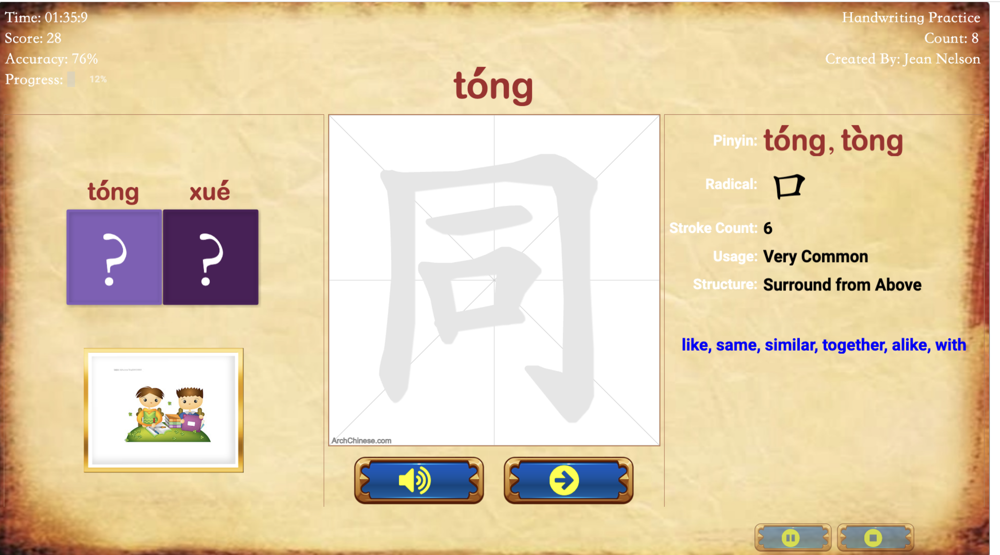
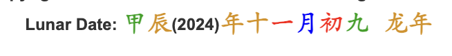
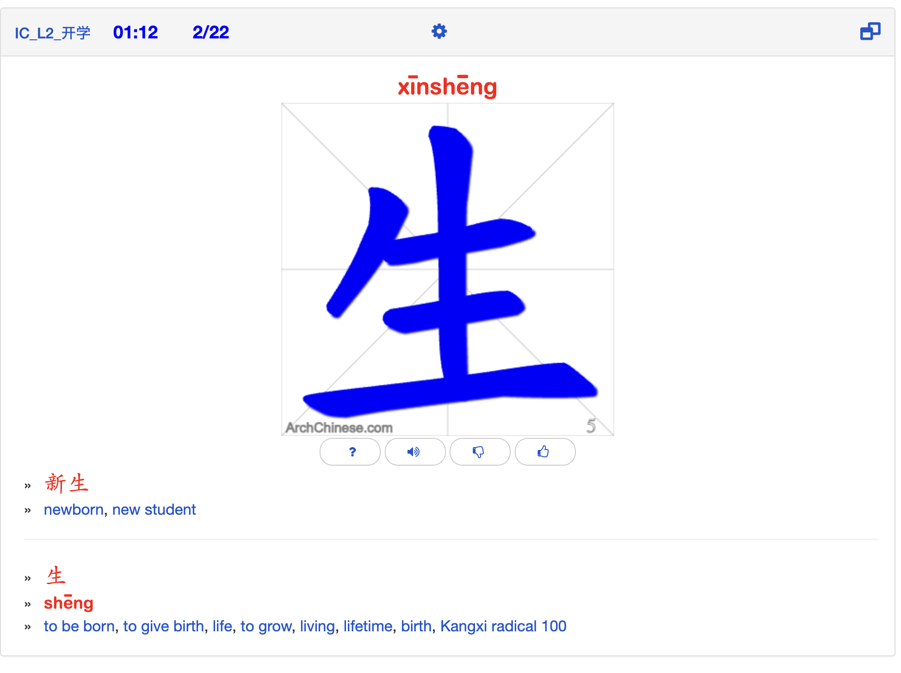

# https://www.archchinese.com/game.html?g=775cf9ab85e1e8j92189a1c852c203284feb

# https://app.kanjialive.com/%E8%AA%AD
# creative commons
- https://henckq.nl/kanji/
# https://skritter.com/demo
# https://www.archchinese.com/chinese_handwriting_practice.html
- Lunar date
- 
# 
# Animations
- underline on hover
  - https://kanji.sh/write
# https://www.bihua.app/en
# hua jia 画家 🧑‍🎨
- 
- https://au.pinterest.com/pin/710583647491136720/ (logo)

# things to try
- PR👀JECTS
  - https://mill3.studio/en/ 
# in the style of a chinese tear calendar thingo

# big influences
- https://au.pinterest.com/pin/835488168408674627/
- https://au.pinterest.com/pin/722827808976482865/